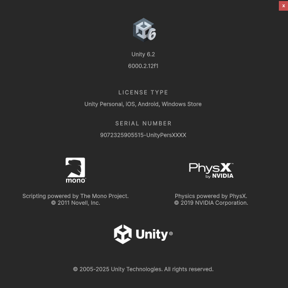
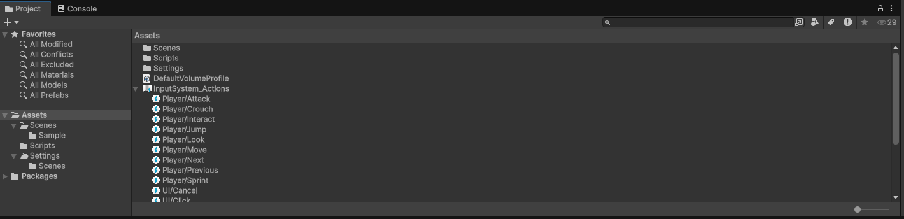
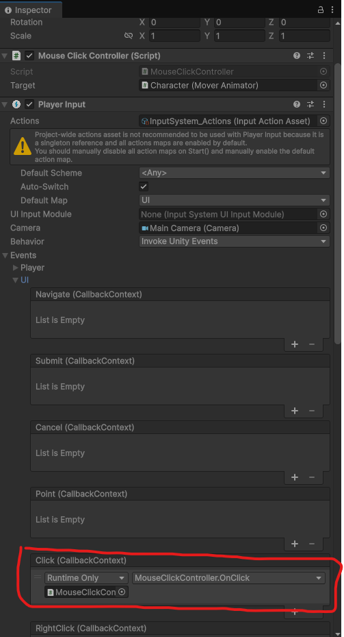
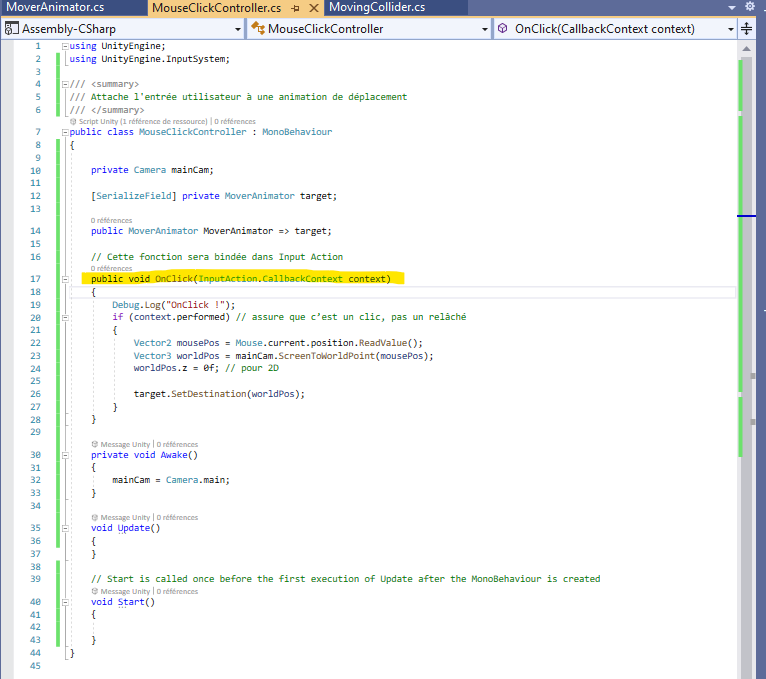
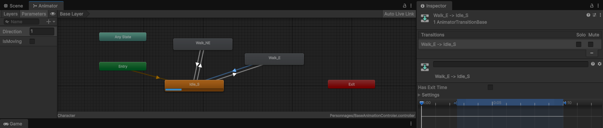
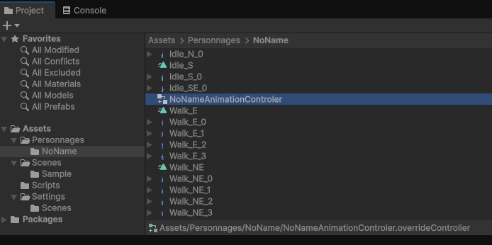

# Point&Click

## Configuration du projet Unity

**Projet Universal Render 2D**

**Gestion des Inputs**

Gestion des binding sur les inputs (clavier/souris/joystick,...)

Attacher la méthode `OnClick` à l'objet `MouseClickController`

**Animation du personnage**

La propriété Has Exit Time permet de stopper l'animation immédiatement avant de passer à l'état suivant.

Le contrôleur d'animation de base fonctionne pour les animations de personnages à 8 directions

Pour adapter le contrôleur à d'autres images de sprite et garder le fonctionnement, il faut créer un `Animation Override Controller`

et changer les groupes de sprite pour chaque direction dans les propriétés

