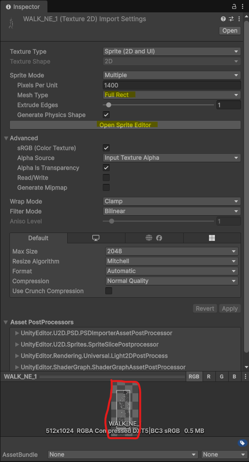
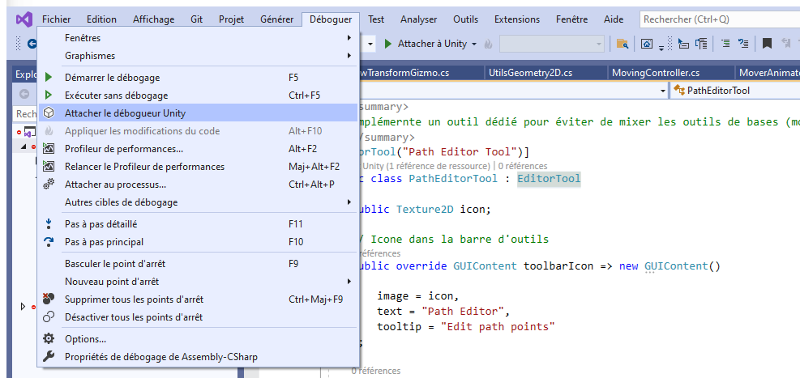
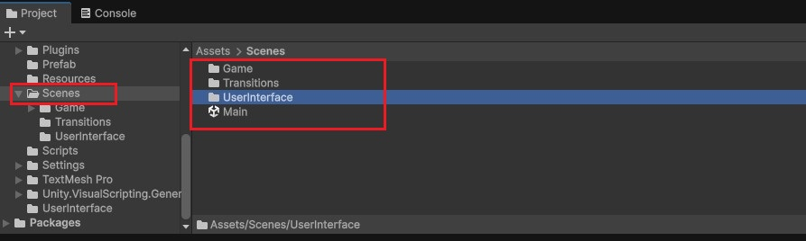
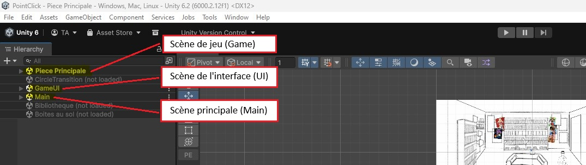
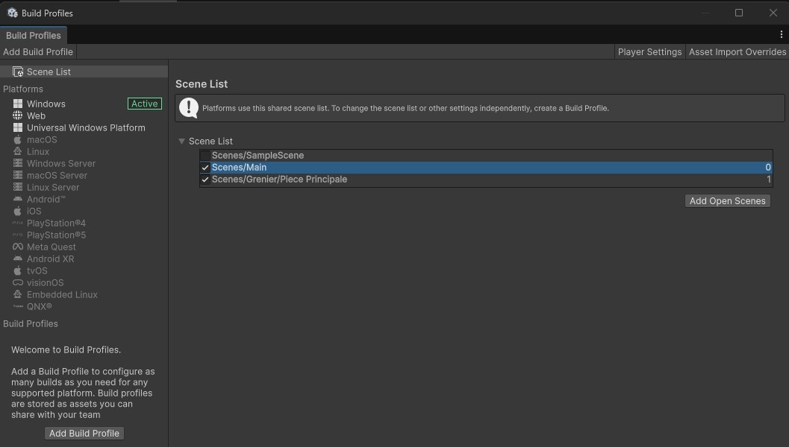
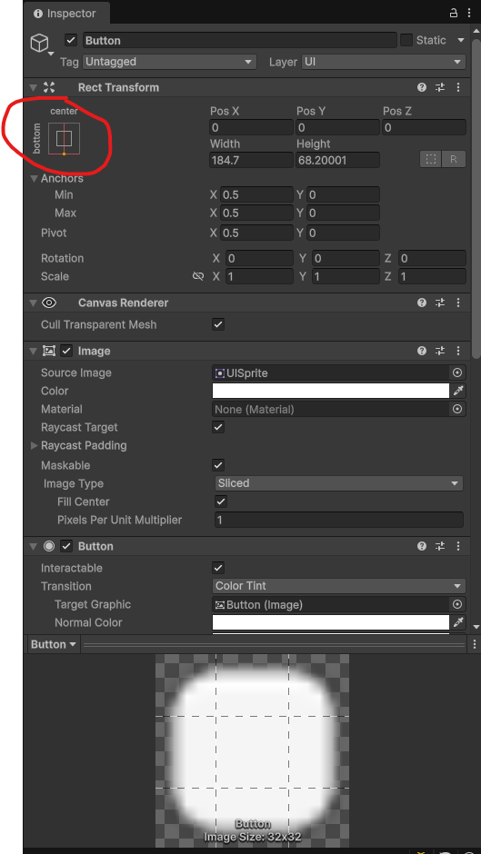
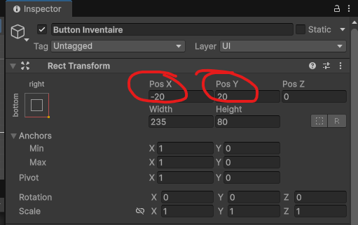
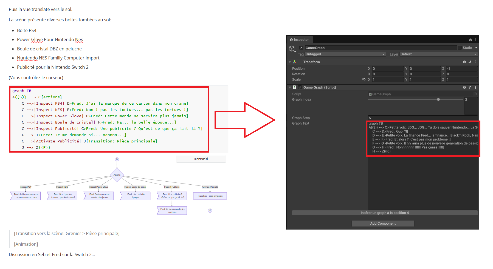

# Point&Click

## Configuration du projet Unity

**Projet Universal Render 2D**

**Gestion des Inputs**

Gestion des binding sur les inputs (clavier/souris/joystick,...)

Attacher la méthode `OnClick` à l'objet `MouseClickController`

**Sprites personnages**

Lors de l'importation des sprites vérifier que celui-ci n'est pas tronqué automatiquement.

Vérifier que le type est bien Full Rect et si celui-ci est quand même tronqué (comme dans l'exemple ci dessous), ouvrir l'éditeur de sprite et ajuster le rectangle pour qu'il prenne toute l'image.

**Animation du personnage**

La propriété Has Exit Time permet de stopper l'animation immédiatement avant de passer à l'état suivant.

Le contrôleur d'animation de base fonctionne pour les animations de personnages à 8 directions

Pour adapter le contrôleur à d'autres images de sprite et garder le fonctionnement, il faut créer un `Animation Override Controller`

et changer les groupes de sprite pour chaque direction dans les propriétés

**Ordre de profondeur des objets**

L'ordre de rendu est définit sur l'axe `Y` ce qui permet d'utiliser la position des objets comme profondeur de champ. Cela permet de simuler un personnage qui passe devant ou derrière un objet.

Note la profondeur est géré par `Layer` donc `Background` ne passera jamais devant `Character`

**Déboguer avec VisualStudio**

Attacher le debogeur Unity depuis l'éditeur Visual Studio

## Scénes

### Organisation des scènes

Sous Unity le jeu est composé de différentes **Scènes**. Chaque scène et ses objets peuvent être chargé/déchargé individuellement et en complément des scènes déjà existantes.

**Dans ce projet les scènes se groupées ainsi:**

* La scène de démarrage (toujours active) : `Main`
* Les scènes d'interfaces utilisateurs : `Scenes/UserInterface/*`
* Les scènes de jeux : `Scenes/Game/*`
* Les scènes de transitions : `Scenes/Transitions/*`

**Les scènes sont combinables mais pas dans n'importe quel ordre:**

* `Main` est toujours actif et contient les objets single-instance (`PlayerInput`, `MainCamera`, `Persistant`, ...)
* 1 scène de `UserInterface` à la fois
* 1 scène de `Game` à la fois
* La scène `Transition` est chargé et déchargé automatiquement lors de la transition d'une scène `Game`

**Editeurs**

En mode **Editeur** vous devez donc avoir au moins plusieurs scènes ouverte pour faire fonctionner le jeu: `Main`, 1 scène de `Game` et 1 scène de `UserInterface`.

**Handler/Manager/Controller**

Certains objets on besoins d'être relier à des objets de la scène `Main`, les objets étant dans des scènes différentes il existe des objets intermédiaires nommé `Handler` (ex: `GameDataHandler`) ou directement accessible par script (ex: `GameData`).

### Données persistantes

Les données persistantes entre les scènes sont contenu dans le `GameObject` nommé `Persistant` il est contenu dans la scène Main qui est constamment chargé. Les autres scènes sont ouvertes en plus de la scène principale.

## Build

Toutes les scènes faisant partie du **build final** doit se trouver dans la liste des scènes accessibles depuis le menu **File > Build Profiles**.

Les scène ne se trouvant pas dans cette liste de pourrons pas êtres ouvertes avec `SceneManager.LoadScene()`

La scène n°0, sera la première scène chargé au démarrage de l'application.

 

## Interface Utilisateur

l'UI est implémenté derrière un objet **Canvas** permettant de séparer l'espace de la scène avec celle de l'UI en Overlay.

### Placement ancré

Pour placer un élément dans la zone de l'écran, utiliser les ancrages sur les objets du Canvas.

> Maintenir le bouton `Alt + Shift` pour réinitialiser le pivot et le placement aux limites de l'écran.

En fonction du type d'ancrage `Stretch` ou `Non-Stretch` il faut utiliser respectivement `Pos X,Pos Y` ou `Left,Top` pour spécifier les marges supplémentaires (et donc éviter d'être totalement collé au bord de l'écran).

## Son et Bruitages

### Bruitage sur événement d'animation

Certains bruitages son synchronisés avec les frames d'animations visuels.

Pour se faire il faut se rendre dans la vue **Animation** et ajouter des événements sur les frames qui doivent  déclencher un son.

La méthode appelée est programmée dans un **GameObject** nommé **SoundController** dédié au personnage.

## Evénements et séquences

l'organisation des animations et événements déclancheurs sont décrit dans une série de graphs au format Mermaid directement utilisable dans l'éditeur Unity.

Les séquences sont décrites de facon textuels dans le document [Evenements et progressions](../../Evenements et progressions.md) puis copié/collé dans l'objet GameGraph comme ceci:

> Attention à respecter l'ordre car chaque fin de graph correspond au début du prochain.
